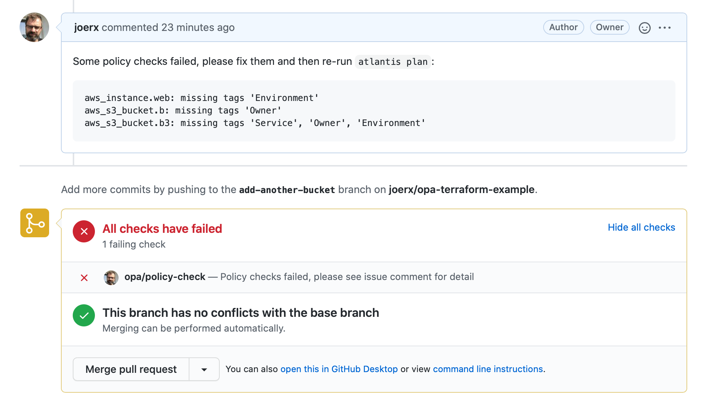

# OPA Atlantis Sidecar

Small OPA integration to be used with [Atlantis](https://www.runatlantis.io) as a sidecar or as part of other Terraform CI pipelines. Exposes a HTTP endpoint that validates a JSON plan and updates a VCS pull request status depending on the result.

_Note: this is only PoC at this stage - nothing really works and it's terrible code style._



## Request Format

```json
{
  "vcs": {
    "owner": "BASE_REPO_OWNER",
    "name": "BASE_REPO_NAME",
    "pull_num": "PULL_NUM"
  },
  "plan": {
    "...": "terraform plan output"
  }
}
```

## Usage

```sh
opa-sidecar server -addr localhost:9090 -policy ./policies
```

## Example Execution

```bash
plan_json=$(terraform${ATLANTIS_TERRAFORM_VERSION} show -json ${PLANFILE})
vcs="\"owner\": \"${BASE_REPO_OWNER}\", \"name\": \"${BASE_REPO_NAME}\", \"pull_num\": \"${PULL_NUM}\""

data="{\"vcs\": ${vcs}, \"plan\": ${plan_json}}"

curl -sS -X POST -d "${data}" -H "Content-type: application/json" http://localhost:9090/check
```
